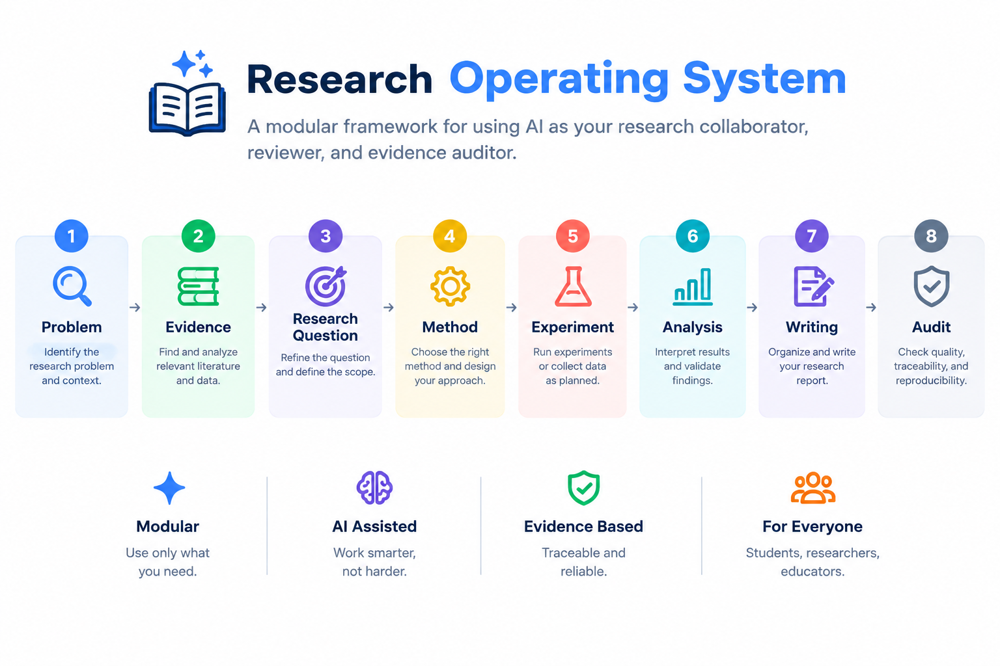

# Research Operating System v1.0.0

[](LICENSE)
[](CHANGELOG.md)

**A modular AI-powered research framework that turns AI into a disciplined research collaborator - not an answer generator.**

> Use AI to support real academic research: literature review, methodology design, experiment validation, analysis, and writing - with built-in evidence discipline and integrity checks.

---

## Table of Contents

- [What Is This?](#what-is-this)
- [Who Is This For?](#who-is-this-for)
- [How It Works](#how-it-works)
- [Quick Start](#quick-start)
- [Supported Platforms](#supported-platforms)
- [Repository Structure](#repository-structure)
- [Documentation](#documentation)
- [Contributing](#contributing)
- [License](#license)

---

## What Is This?

Research Operating System (Research OS) is a collection of structured protocol files that you upload to AI platforms (ChatGPT, Gemini, Claude, etc.) to transform them into a **research-aware collaborator**.

It helps with:

- **Literature review** - source evaluation, evidence synthesis, gap identification
- **Research planning** - problem definition, research question formulation
- **Methodology design** - research design, variables, sampling, validity
- **Experiment validation** - leakage prevention, baseline fairness, reproducibility
- **Analysis** - statistical testing, uncertainty, interpretation boundaries
- **Academic writing** - evidence-based prose, terminology consistency, citation accuracy

### What It Is NOT

- It is NOT an automatic thesis generator
- It is NOT a tool that writes papers for you
- It is NOT a shortcut to skip real research work

### What It Maintains

- Evidence traceability
- Research integrity
- Verification discipline
- Reproducibility standards
- Calibrated claims (no overclaiming)

---

## Who Is This For?

| User | Use Case |
|---|---|
| **Undergraduate students** | Thesis/skripsi research with proper methodology |
| **Graduate students** | Systematic literature reviews, experiment design |
| **Researchers** | AI-assisted research with integrity guardrails |
| **Academic supervisors** | Audit and review student research quality |
| **Anyone using AI for research** | Prevent AI hallucination in academic work |

---

## How It Works



The system uses a **modular architecture**:

1. **Router** (`RESEARCH.md`) - determines which modules to load based on your task
2. **Core** (`00-RESEARCH-CORE.md`) - universal research integrity rules (always loaded)
3. **Specialized Modules** - loaded only when needed:
   - `01` Writing | `02` Human subjects | `03` Literature | `04` Methodology | `05` Experiment | `06` Analysis
4. **Support Files** - audit, decision log, project context, domain adaptation, background generator

**Principle: load only what you need.** Never upload all files at once without purpose.

---

## Quick Start

### Step 1 - Understand the System

Read [START-HERE.md](START-HERE.md) for a beginner-friendly overview.

### Step 2 - Choose Your Language

- **Bahasa Indonesia** - [Panduan Pengguna](docs/USER-GUIDE-ID.md)
- **English** - [User Guide](docs/USER-GUIDE-EN.md)

### Step 3 - Choose Your AI Platform

| Platform | What to Upload | Guide |
|---|---|---|
| ChatGPT Projects | `AGENTS.md` + `RESEARCH.md` + modules | [Platform Map](docs/PLATFORM-USAGE-MAP.md) |
| Gemini Gems | `RESEARCH.md` + knowledge files | [Platform Map](docs/PLATFORM-USAGE-MAP.md) |
| Claude Projects | `RESEARCH.md` + modules | [Platform Map](docs/PLATFORM-USAGE-MAP.md) |
| NotebookLM | Papers + literature module | [Platform Map](docs/PLATFORM-USAGE-MAP.md) |
| Coding Agents | `AGENTS.md` | [Platform Map](docs/PLATFORM-USAGE-MAP.md) |

### Step 4 - Start Your Research

Use the Prompt Library ([English](prompts/PROMPT-LIBRARY-EN.md) | [Indonesia](prompts/PROMPT-LIBRARY-ID.md)) for ready-to-use prompts, or follow the research lifecycle in [RESEARCH.md](research-protocol/RESEARCH.md).

---

## Supported Platforms

| Platform | Best For |
|---|---|
| **ChatGPT Projects** | Full research workflow (recommended) |
| **Gemini Gems** | Knowledge-based research sessions |
| **Claude Projects** | Deep analysis and long-context tasks |
| **NotebookLM** | Literature analysis and evidence extraction |
| **Coding Agents** | Computational research and experiment code |

---

## Repository Structure

```
research-operating-system/
|
|-- README.md                          # You are here
|-- START-HERE.md                      # Beginner onboarding guide
|-- LICENSE                            # MIT License
|-- CONTRIBUTING.md                    # How to contribute
|-- CHANGELOG.md                       # Version history
|
|-- docs/                              # User documentation
|   |-- USER-GUIDE-EN.md               # English user guide
|   |-- USER-GUIDE-ID.md               # Panduan pengguna (Indonesia)
|   |-- FILE-FUNCTION-MAP.md           # What each file does
|   \-- PLATFORM-USAGE-MAP.md         # Platform-specific setup
|
|-- prompts/                           # Ready-to-use prompt templates
|   |-- PROMPT-LIBRARY-EN.md          # Prompt collection (English)
|   \-- PROMPT-LIBRARY-ID.md          # Pustaka prompt (Indonesia)
|
|-- research-protocol/                 # Core protocol files
|   |-- RESEARCH.md                    # Main router (start here for research)
|   |-- AGENTS.md                      # AI agent configuration
|   |-- 00-RESEARCH-CORE.md            # Universal research rules
|   |-- 01-research-writing.md         # Academic writing module
|   |-- 02-research-human.md           # Human subjects module
|   |-- 03-research-literature.md      # Literature review module
|   |-- 04-research-methodology.md     # Methodology design module
|   |-- 05-research-experiment.md      # Experiment validation module
|   |-- 06-research-analysis.md        # Analysis module
|   |-- 07-research-audit.md           # Final audit module
|   |-- 08-research-decision-log.md    # Decision tracking template
|   |-- 09-project-context-template.md # Project context template
|   |-- 10-research-domain-adaptation.md # Multi-domain support
|   \-- 11-research-background-generator.md # Background section guide
|
\-- assets/
    \-- images/                        # Diagrams and visuals
```

---

## Documentation

| Document | Description |
|---|---|
| [START-HERE.md](START-HERE.md) | Beginner onboarding |
| [User Guide (EN)](docs/USER-GUIDE-EN.md) | English setup and usage |
| [Panduan Pengguna (ID)](docs/USER-GUIDE-ID.md) | Panduan Bahasa Indonesia |
| [File Function Map](docs/FILE-FUNCTION-MAP.md) | What each file does |
| [Platform Usage Map](docs/PLATFORM-USAGE-MAP.md) | Platform-specific instructions |
| [Prompt Library (EN)](prompts/PROMPT-LIBRARY-EN.md) | Ready-to-use prompts (English) |
| [Pustaka Prompt (ID)](prompts/PROMPT-LIBRARY-ID.md) | Prompt siap pakai (Indonesia) |
| [RESEARCH.md](research-protocol/RESEARCH.md) | Main research router |

---

## Contributing

Contributions are welcome! Please read [CONTRIBUTING.md](CONTRIBUTING.md) before submitting.

---

## License

This project is licensed under the [MIT License](LICENSE).

---

<p align="center">
  <strong>Research Operating System</strong> - Evidence before prose. Verification before PASS.
</p>

